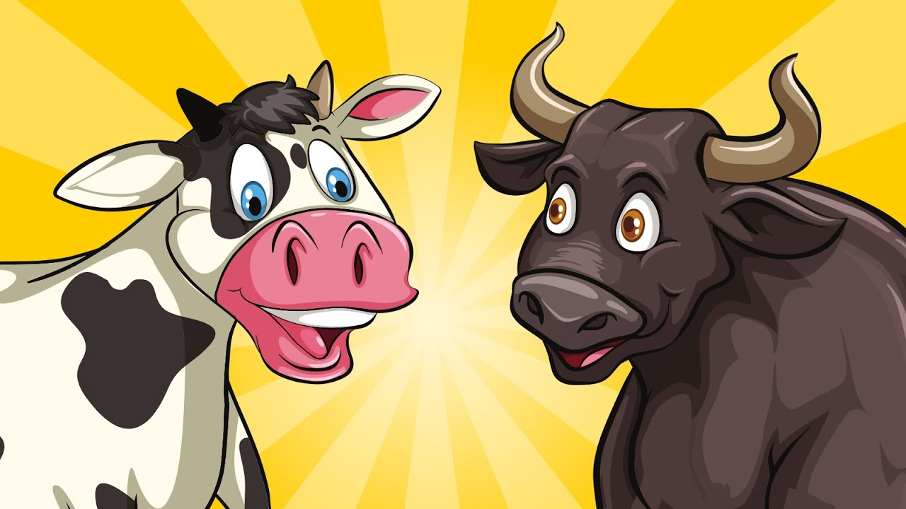

# Bulls and Cows Game - Java Implementation
This repository contains a Java implementation of the classic "Bulls and Cows" game with different levels of AI opponents. The game allows players to guess a secret code while getting hints in the form of bulls (correct digits in the correct position) and cows (correct digits in the wrong position).

## Table of Contents
1. Overview of Classes
2. How to Play
3. Game Rules
4. Customizing the Game
5. AI Difficulty Levels
6. Class Implementation Details

## Overview of Classes
* `BullsAndCows`: The main class that runs the game, manages user input, and coordinates the other classes.
* `Guess`: Represents an individual guess made by a player during the game and provides methods for validating, calculating cows and bulls, and checking the correctness of the guess.
* `Players`: Represents a player in the game and is responsible for generating and storing the player's secret code.
* `AIOpponent`: A subclass of Players representing the computer player. It manages the AI opponent's game state and generates guesses.
* `EasyAI`: A subclass of AIOpponent representing the easy AI opponent.
* `MediumAI`: A subclass of AIOpponent representing the medium AI opponent.
* `HardAI`: A subclass of AIOpponent representing the hard AI opponent.
* `Users`: A subclass of Players representing the human player.
* `ConfigReader`: A utility class to read the configuration file for the game settings.

## How to Play
1. Compile all the classes using the `GameLauncher.java` class.
2. Follow the on-screen prompts to select a difficulty level and start playing the game.

## Game Rules
* The objective of the game is to guess a secret 4-digit code.
* Each digit in the code is unique, i.e., no digit is repeated.
* After each guess, you'll receive feedback in the form of "bulls" and "cows".
* A "bull" means you've guessed a correct digit in the correct position.
* A "cow" means you've guessed a correct digit, but it's in the wrong position.
* The game continues until you correctly guess the secret code or reach the maximum number of allowed guesses.

## Customizing the Game
The EasyAI level can be customized by modifying the `easy_ai_config.txt` file located in the root of the project. This configuration file determines the maximum number of turns and the length of the secret code for the EasyAI level.

### Configuration Format
The `easy_ai_config.txt` file contains two lines:

* The first line represents the maximum number of turns allowed for the game.
* The second line represents the length of the secret code.

### How to Configure the Values
To change the maximum number of turns or the secret code length for the EasyAI level, follow these steps:

1. Open the easy_ai_config.txt file in a text editor.
2. Replace the value on the first line with the desired maximum number of turns (e.g., 10).
3. Replace the value on the second line with the desired secret code length (e.g., 5).
4. Save the changes to the easy_ai_config.txt file.

After updating the `easy_ai_config.txt` file, the game will use the new values for the EasyAI level when it's launched.

## AI Difficulty Levels
There are three AI difficulty levels in the game:

1. `EasyAI`: The AI opponent generates a secret code, but it doesn't try to intelligently guess the human player's secret code. It simply uses the provided configuration settings to generate the secret code. This level is suitable for beginners who are just starting to play the game and want to learn the basic mechanics.

### Logic:
The EasyAI class extends the AIOpponent class and represents an easy difficulty level AI opponent in the Bulls and Cows game. When an EasyAI object is created, it can either use the default values for `maxTurns` and `secretCodeLength` or read these values from a configuration file using the ConfigReader class. The EasyAI class generates its secret code of a specified length by randomly choosing non-repeating digits from 0 to 9. The secret code is then stored in the `secretCode` attribute inherited from the AIOpponent class. The EasyAI class also provides getter methods to access the `maxTurns` and `secretCodeLength` values, which can be used by the BullsAndCows class to set up and manage the game. The actual guessing logic for the EasyAI class is inherited from the AIOpponent class, which generates random guesses without considering any previous guesses or game state.

2. `MediumAI`: The AI opponent generates random guesses without repetition, making it harder to beat than the easy AI. The MediumAI class extends the AIOpponent class and overrides the makeAGuess() method to generate unique random guesses. This level is suitable for players who are familiar with the game and want a bit more challenge.

### Logic:
The MediumAI class extends the AIOpponent class and represents a medium difficulty level AI opponent in the Bulls and Cows game. The primary difference between MediumAI and EasyAI lies in the guessing logic. In MediumAI, the `makeAGuess` method is overridden to generate random guesses without repetition. When making a guess, MediumAI generates a random guess and checks whether the guess has been made before. If the guess is repeated, it will continue generating random guesses until a unique, non-repeated guess is found. Once a unique guess is determined, it is added to the list of previous guesses by calling the `addGuess` method from the AIOpponent class. The generated guess is then returned as a Guess object. This approach ensures that the MediumAI opponent doesn't make the same guess multiple times, making it slightly more challenging than the EasyAI opponent.

3. `HardAI`: The AI opponent uses a more intelligent approach to guess the human player's secret code, making it the most challenging opponent. The HardAI class generates all possible codes and iteratively eliminates inconsistent guesses based on the previous guesses' bulls and cows feedback. It also selects the next guess by minimizing the number of remaining possible codes, making it harder for the human player to win. This level is suitable for experienced players who want a tough challenge.

### Logic:
The HardAI class extends the AIOpponent class and represents a hard difficulty level AI opponent in the Bulls and Cows game. The primary distinction between HardAI and the other AI opponents is its intelligent guessing strategy. The class initializes a list of all possible unique 4-digit codes called `possibleCodes`. The `makeAGuess` method is overridden to generate more intelligent guesses after the first random guess.

For the first guess, HardAI generates a random guess, while subsequent guesses are determined through the `getNextIntelligentGuess` method. This method calculates a count for each possible code remaining, representing the number of inconsistent previous guesses with that code. It then selects a candidate code from the codes with the minimum count of inconsistent previous guesses. If there are multiple candidates with the same minimum count, it randomly chooses one of them. This approach significantly narrows down the possible secret codes based on previous guesses and their outcomes, making HardAI a more challenging opponent than EasyAI and MediumAI.

## Class Implementation Details

* `GameLauncher`: This class is responsible for initializing and starting the Bulls and Cows game. It provides a main() method, which serves as the entry point of the program. It creates an instance of the BullsAndCows class, configures the game's settings (such as the AI difficulty level), and starts the game loop by calling the playGame() method.

* `BullsAndCows`: This is the main class responsible for running the game. It interacts with the user, takes their input, and plays the game using other classes. The class also handles different AI difficulty levels by initializing the appropriate AI opponent class.

* `Players`: This is an abstract class that represents a generic player in the game. It stores a secret code and provides methods to manage the secret code and calculate bulls and cows for a given guess.

* `AIOpponent`: This abstract class extends the Players class and represents an AI opponent in the game. It provides methods for generating a secret code and making a guess. Specific AI difficulty levels (EasyAI, MediumAI, and HardAI) extend this class to implement their unique guessing strategies.

* `EasyAI`: This class extends the AIOpponent class and represents an easy AI opponent. It reads configuration settings from a file or uses default values, generates a secret code, and provides methods to get the maximum number of turns and the secret code length.

* `MediumAI`: This class extends the AIOpponent class and represents a medium difficulty AI opponent. It overrides the makeAGuess() method to generate unique random guesses without repetition.

* `HardAI`: This class extends the AIOpponent class and represents a hard difficulty AI opponent. It generates all possible codes and uses an intelligent algorithm to guess the human player's secret code. The algorithm iteratively eliminates inconsistent guesses based on the previous guesses' bulls and cows feedback and selects the next guess by minimizing the number of remaining possible codes.

* `Users`: This class extends the Players class and represents a human user in the game.

* `Guess`: This class represents a single guess made by a player. It stores the guessed code and the corresponding bulls and cows for that guess. It also provides methods to calculate bulls and cows for a given guess against the secret code.

* `ConfigReader`: This class is responsible for reading the configuration file, which contains the maximum number of turns and the secret code length. It provides methods to get these values.

## Final UML Diagram:

